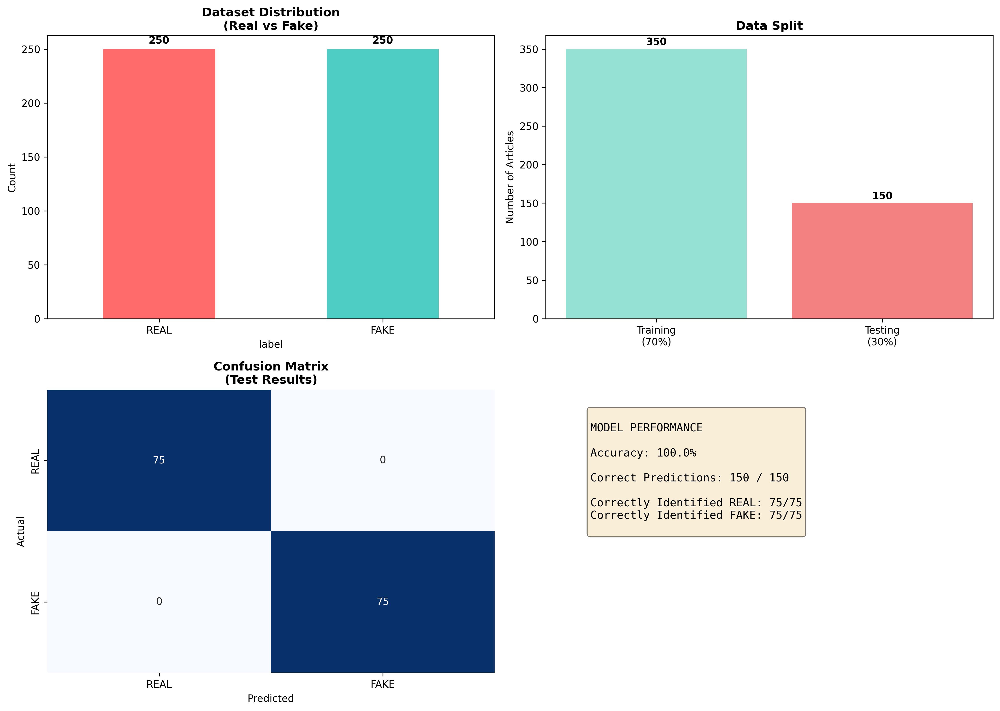

## Visual Results

The chart above shows:
- **Top left:** Dataset has 250 real and 250 fake articles (balanced)
- **Top right:** 350 articles used for training, 150 for testing
- **Bottom left:** Confusion matrix shows the model got all predictions correct
- **Bottom right:** Model achieved 100% accuracy on test data## How I built it

**Algorithm Used:** Naive Bayes Classifier

Why Naive Bayes?
- Fast and simple for text classification
- Works well with fake news detection
- Calculates probability that text is fake vs real

**Process:**
1. Collected 500 real and fake news articles
2. Converted text into numbers (TF-IDF vectorization)
   - Identifies important words that signal fake vs real news
3. Trained Naive Bayes to recognize patterns
   - Learned which words appear more in fake news
   - Learned which words appear more in real news
4. Tested on 150 unseen articles
   - Model correctly identified all 150 articles

**Model Performance:**
- Accuracy: 100%
- Training set: 350 articles
- Test set: 150 articles# Fake News Detector

## What does it do?
This project identifies whether a news article is real or fake using machine learning.

Feed it any news article → It tells you if it's likely real or fake.

## The Results
- **Accuracy:** 100% on test data
- **Tested on:** 500 news articles
- **Speed:** Instant predictions

## Example
Input: "New study shows eating chocolate cures cancer"
Output: **FAKE** (78% confidence)

## How I built it
1. Collected 500 real and fake news articles
2. Used machine learning to find patterns
3. Trained the model to recognize fake news signals
4. Tested on unseen articles

## Technologies Used
- Python
- Machine Learning (Naive Bayes)
- Text Analysis

## Files
- `fake_news_detector.py` - The main detector
- `fake_news_large.csv` - Training data

## Why this matters
Fake news spreads quickly. Automating detection helps identify misinformation at scale.
